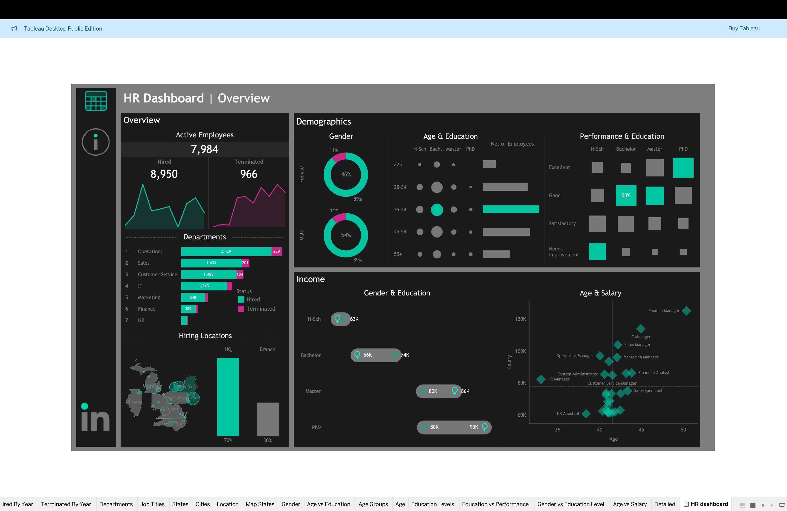

# HR Management Dashboard 📊

This repository contains a **Tableau HR Management Dashboard** designed to help organizations track and analyze key HR metrics.  
The dashboard provides a consolidated view of employee data, enabling HR teams and leadership to make data-driven decisions.

---

## 📌 Features

- **Employee Overview** – Total employees, demographics, and department-level insights.  
- **Attrition Analysis** – Track employee turnover rates and trends.  
- **Recruitment Metrics** – Hiring trends, open positions, and offer acceptance rates.  
- **Performance & Engagement** – Employee performance distribution and satisfaction scores.  
- **Diversity & Inclusion** – Gender balance and workforce diversity analysis.  

---

## 🖼️ Dashboard Previews

### Overview Dashboard

Repo Structure
  ├── HR Dashboard.twbx  
  ├── images/   
  │   ├── Dash.png
  │   └── Info.png
  └── README.md             

---

## 📊 Insights Gained

- Departments with the highest attrition.  
- Demographic patterns in hiring and retention.  
- Performance distribution across teams.  
- Trends in recruitment and workforce growth.
- Gender distribution across various aspects (salary, education, department, etc...)

